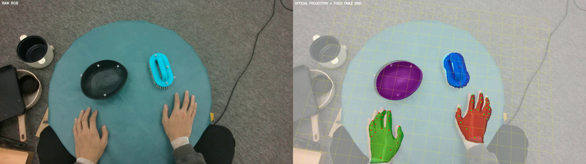
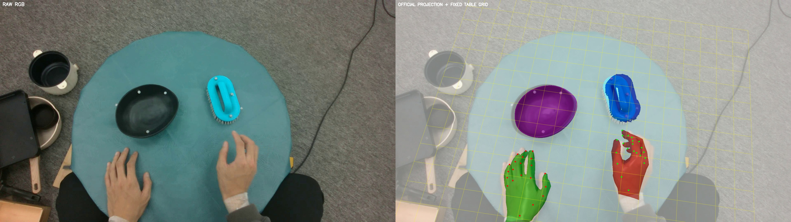
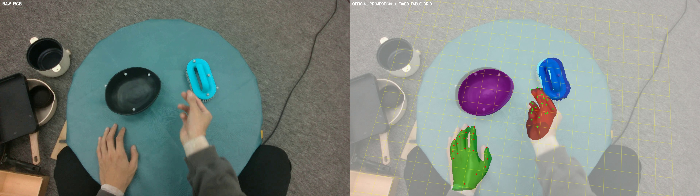
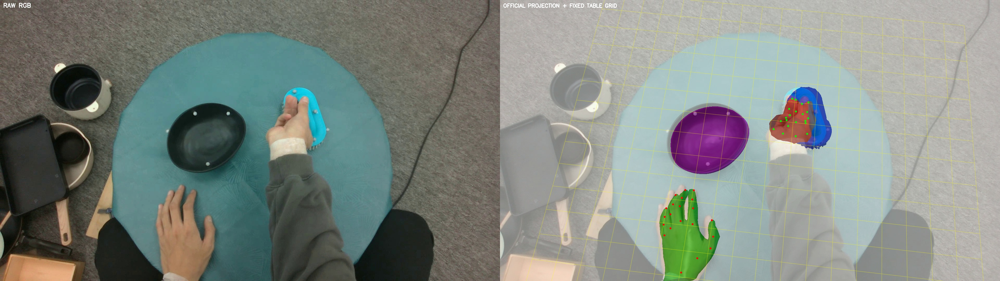
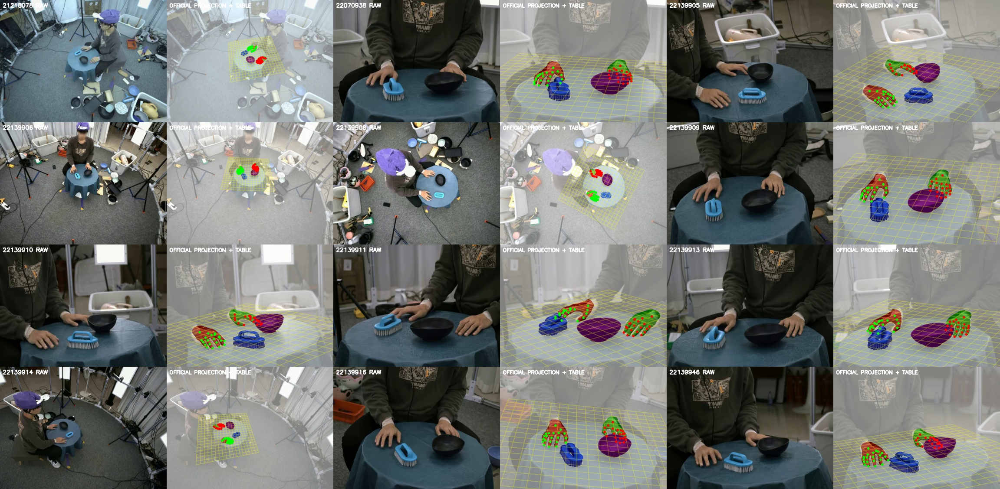

# Table-plane visual review

This is a required human semantic gate. The fixed grid was not fitted to pixels.

## Egocentric frame 0

## Egocentric frame 5

## Egocentric frame 10

## Egocentric frame 20

## Allocentric frame 0

## Required answers

- `table_plane_alignment`: `PENDING`
  - allowed: `CLEARLY_ALIGNED_WITH_VISIBLE_TABLE`
  - allowed: `CLEARLY_MISALIGNED_WITH_VISIBLE_TABLE`
  - allowed: `TABLE_NOT_VISUALLY_IDENTIFIABLE`
- `bowl_support_state`: `PENDING`
  - allowed: `RESTING_ON_TABLE`
  - allowed: `HELD_ABOVE_TABLE`
  - allowed: `AMBIGUOUS`

No z offset or alternate alignment may be inferred automatically from this review.
