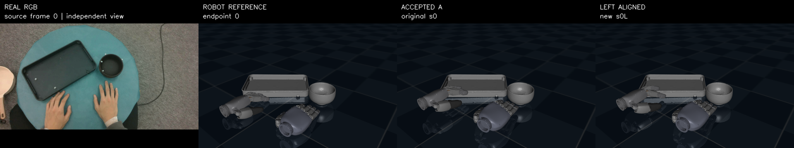
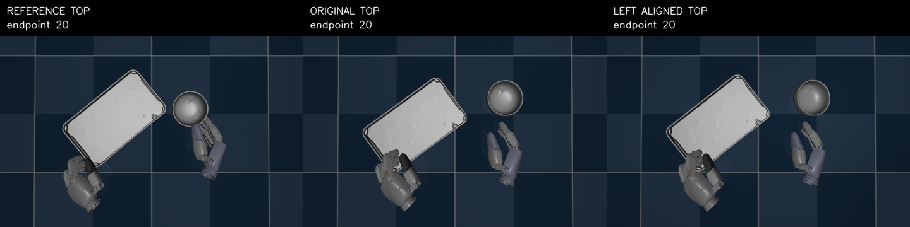

# Left initial alignment v1

## Result

`MIXED_EARLY_RESPONSE_WITH_ENDPOINT20_POSITION_ROTATION_IMPROVEMENT`

One deterministic left-only MINK trajectory produced a distinct legal state at iteration 8. Selection used only the frozen task-space merit and the existing t0 geometry contract; no rollout outcome participated. The right hand, both object primitives, all initial velocities, reference commands, scene, and physics were unchanged. The new left-hand qpos and its consistent initial position target changed together.

| Metric | ORIGINAL | LEFT_ALIGNED_REPLAY |
|---|---:|---:|
| endpoint 0–10 tray position mean | 2.564945 mm | 2.638459 mm |
| endpoint 0–10 tray position max | 4.960198 mm | 3.808468 mm |
| endpoint 0–10 tray rotation mean | 0.036275 rad | 0.026265 rad |
| endpoint 0–10 object-frame pair translation mean | 9.618044 mm | 6.849768 mm |
| endpoint 20 tray position | 25.284542 mm | 18.787399 mm |
| endpoint 20 tray rotation | 0.063371 rad | 0.033336 rad |

Thus the intervention did not uniformly improve early position tracking: its early mean position error rose by about 0.074 mm, while the early maximum, rotation, and object-pair relation improved. The endpoint-20 pose is clearly better numerically and visually. This supports initialization as a contributing factor, not a deployable reset or a full-task fix.

## Contracts and reproducibility

- Static solver: 128 bounded DAQP calls; selected iteration 8 after frozen merit ordering.
- Geometry: candidate passed the full native/runtime t0 gate in float64 and runtime float32. The original run completed 244 checks; two selected-state checks were repeated solely to recover evidence after a final JSON serialization error. MINK and ranking were not rerun.
- Physics: 60 control intervals / 600 task substeps plus two setup steps; zero actor/critic forwards and zero optimizer updates.
- ORIGINAL reproduces the historical trace bitwise; LEFT_ALIGNED_REPLAY and LEFT_ALIGNED_COLD are bitwise equal.
- `LEFT_ALIGNED_HOLD_1` was skipped because encoding the new initial control would require normalized residual magnitude 5.43063, outside the frozen support.
- The full 23 MB evidence, snapshots, raw contacts, force arrays, videos, and 100-file SHA-256 manifest remain on the server at `/data_all/zzx/3.2RL/runs/taco_pour_left_initial_alignment_v1`.
- No chunk was committed and no follow-on or RL run was started.

See [findings.md](findings.md), [summary.json](summary.json), [selection.json](selection.json), and [visual_review.json](review/visual_review.json).
