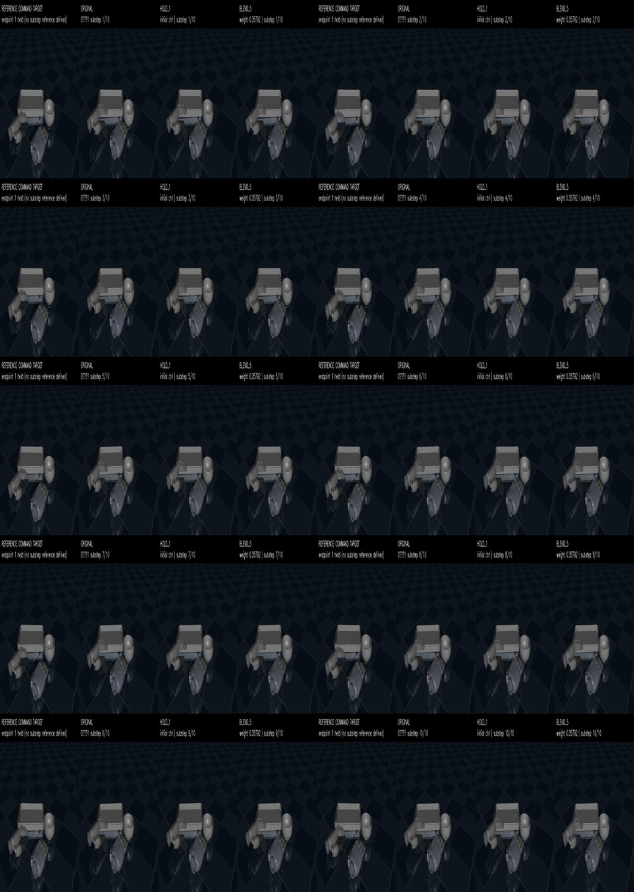
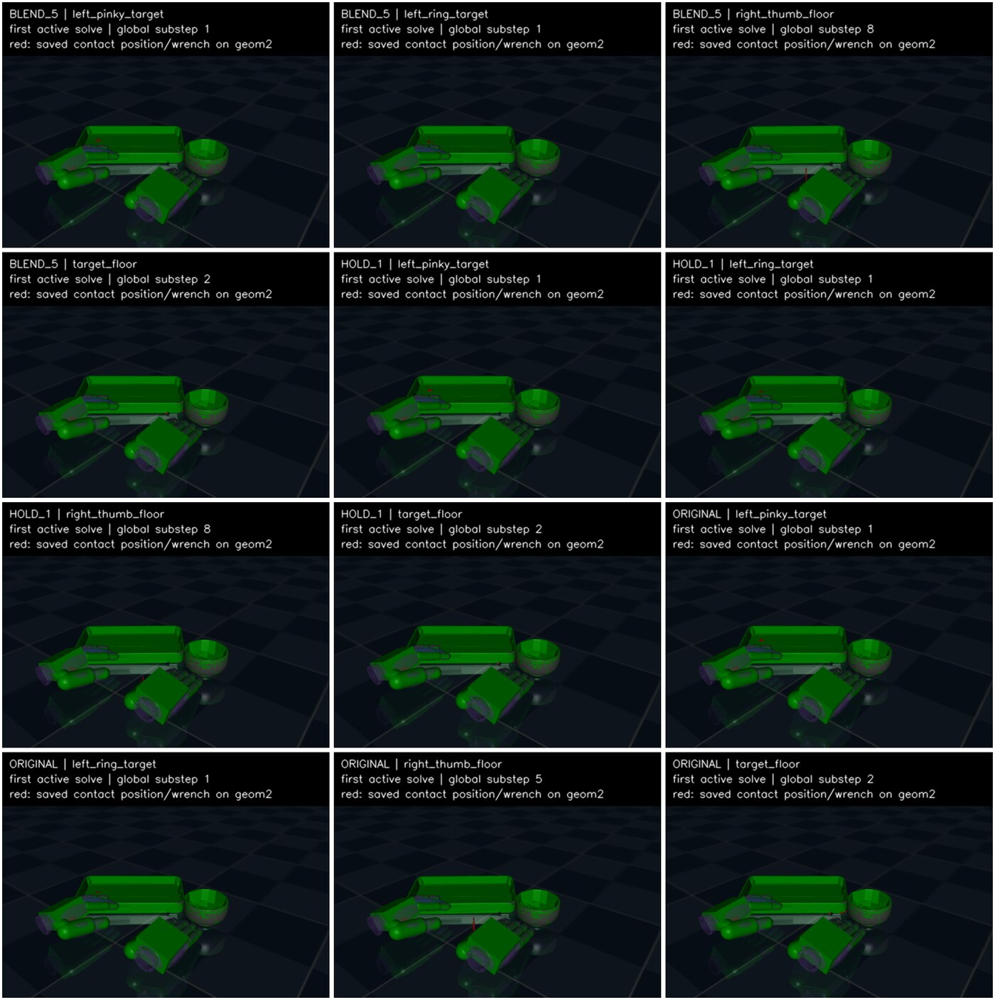
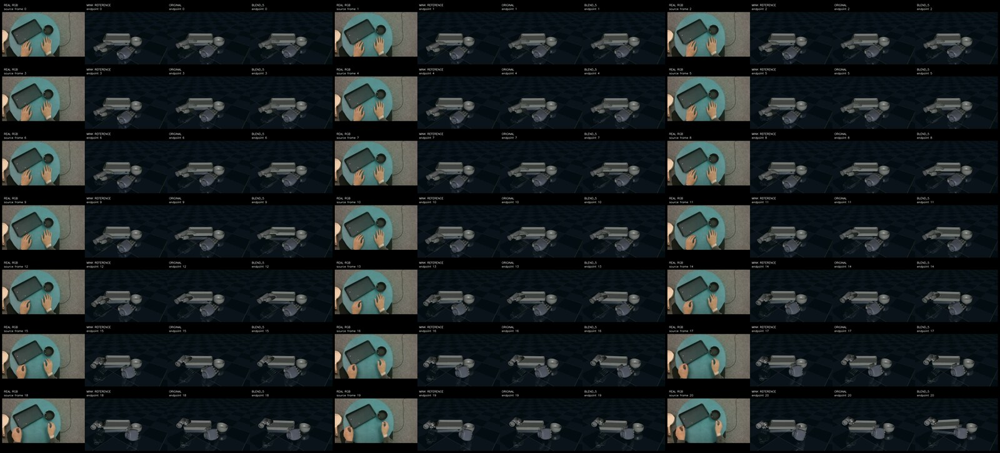
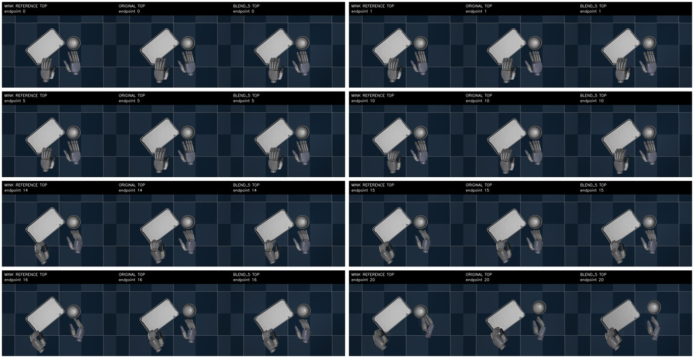

# Startup transition isolation v1

## Decision

The endpoint-0 control discontinuity is a **real causal contributor** to the
early contact transient and to the later tray–bowl relative trajectory.  The
five-cycle blend is **not** a demonstrated task-level repair and is not an
author-recovered EgoEngine controller.

No training or chunk commit was performed.  The complete immutable evidence is
under:

```text
/data_all/zzx/3.2RL/runs/taco_pour_startup_transition_isolation_v1/
```

## Gates

- `ORIGINAL` is bitwise-identical to the historical Replay 0→20 trace at all
  endpoints, all 200 substeps, all active-contact fields, all constraint-force
  arrays, and the complete endpoint-20 snapshot.  No padding exception was
  used.
- `BLEND_5_COLD` is bitwise-identical to `BLEND_5` in a fresh CPU world using
  the saved action array.
- Maximum normalized action was `0.926016` (`HOLD_1`) and `0.872381`
  (`BLEND_5`); there were zero action, residual, or ctrlrange clips.
- Cost was `613 physics steps / 61 task controls`, including three setup
  integrations.  A parity-reporter exception occurred after the already-saved
  ORIGINAL; ORIGINAL was adjudicated offline rather than rerun.  The authorized
  200-step physics retest was not consumed.

## First-cycle effect

Relative to ORIGINAL, BLEND_5 reduced first-cycle normal impulse by:

- left ring → tray: `47.5%`;
- left pinky → tray: `21.1%`;
- tray → floor: `66.9%`;
- right thumb → floor: `63.7%`.

Right-thumb/floor onset moved from physics substep 5 to 8.  At endpoint 1 the
bowl/tool positions differ by only `1.12e-8 m`, while tray/target positions
differ by `0.409 mm`.  The intervention therefore changes the initially loaded
left-hand/tray and floor interfaces before it materially changes the bowl.





## Persistence through endpoint 20

BLEND_5 is exact Replay from source 4 → endpoint 5 onward, but the state branch
persists.  At endpoint 20, BLEND_5 differs from ORIGINAL by:

- bowl/tool position: `3.938 mm`;
- tray/target position: `14.248 mm`;
- tray–bowl relative position: `14.207 mm`.

Both conditions remain within the local tool-only tracking gate through
endpoint 20.  The endpoint-20 tool score is `0.425967` for ORIGINAL and
`0.450322` for BLEND_5.  The reference-relative tray–bowl error remains large
in both (`72.67 mm` vs `71.64 mm`), so startup smoothing is not sufficient to
restore the intended task geometry.





## Boundaries

- `HOLD_1` stops after endpoint 1; later HOLD fields are `N/A`, not passes.
- RGB is independent task context, not camera-registered pixel evidence.
- Only the predeclared five-cycle blend was tested; no duration, gain, seed,
  frame, or action sweep was run.
- This result does not authorize initialization changes, training, or a
  follow-on experiment.

